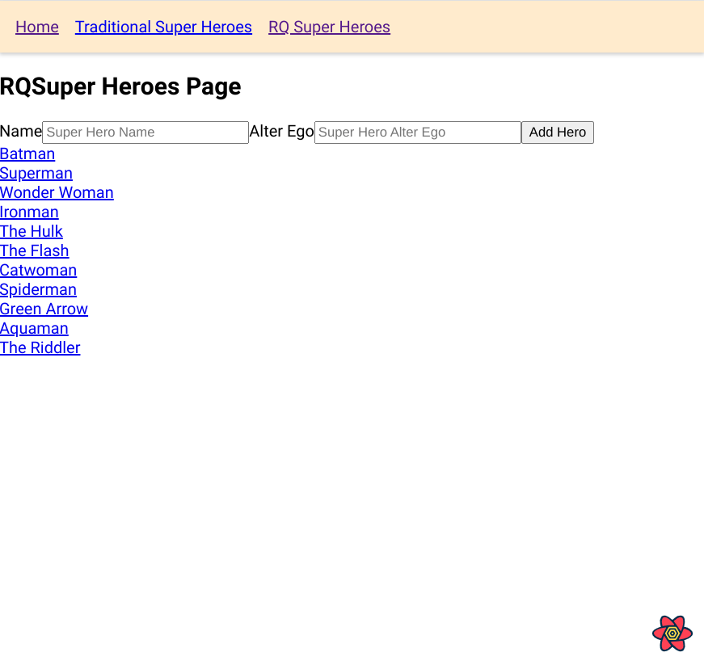

# React Query Demo

This is the completed result from this YouTube series  [Codevolution](https://www.youtube.com/watch?v=VtWkSCZX0Ec&list=PLC3y8-rFHvwjTELCrPrcZlo6blLBUspd2&index=1).

## Table of contents

- [Overview](#overview)
    - [Built with](#built-with)
- [How To Use](#how-to-use)
- [What I learned](#what-i-learned)
- [Useful resources](#useful-resources)

## Overview



I have been trying to explore the React ecosystem to elevate my React skills and React Query seemed worth a tryout. 

React Query will have a new version that makes it compatible with React 18.  

I upgraded to React Router V6.  

### Built with

- [React](https://reactjs.org/)
- [React Query](https://react-query.tanstack.com/)
- [React Router](https://reactrouter.com/docs/en/v6)

## How to Use

To clone and run this application, you'll need [Git](https://git-scm.com) and [Node.js](https://nodejs.org/en/download/) (which comes with [npm](http://npmjs.com)) installed on your computer. From your command line:

```bash
# Clone this repository
$ git clone https://github.com/jdegand/react-query-demo

# Install dependencies
$ npm install

# Run the app - Use 2 terminals 
$ npm run serve-json 
$ npm start
```

### What I learned

- React Query eliminates the need for intermediate variables / state.  
- useQuery returns a unique key and a function.  
- useQuery will automatically retry failed fetch requests 3 times.  
- Every query is cached by default for 5 mins - isFetching flag - refetch in the background
- Add 3rd argument - an object to useQuery to set cacheTime, staleTime, & more
- staleTime - prevent network requests if data is not gonna change often
- refetchOnWindowFocus - any time tab loses + regains focus react query will refetch data
- polling - fetching data at regular intervals - refetchInterval:2000 - interval paused when focus lost
- refetchIntervalInBackground:true to keep interval going
- enabled:false prevents fetch on mount
- destructure refetch from useQuery and pass to event handler to trigger a fetch on an action ie onClick={refetch} 
- select option allows you to immediately transform data returned from useQuery
- queryKey mimics whatever you pass into useQuery
- parallet queries - call useQuery multiple times
- parallel queries need to use aliases to render the data in the jsx
- useQueries hook to batch multiple queries together
- ?_limit="&nbsp;"&_page="&nbsp;" json server pagination convention
- keepPreviousData: true helps prevent layout shift
- useMutation doesn't require a key

- Seems like React Query relies heavily on the context api

### Useful Resources

- [Stack Overflow](https://stackoverflow.com/questions/65552907/unable-to-see-key-value-in-react-or-chrome-devtools) - react keys & devtools
- [LogRocket Blog](https://blog.logrocket.com/react-devtools-5-things-you-didnt-know-you-could-do/) - react devtools
- [Stack Overflow](https://stackoverflow.com/questions/59312961/how-to-use-react-hashrouter-for-route-parameters) - hashrouter and route parameters